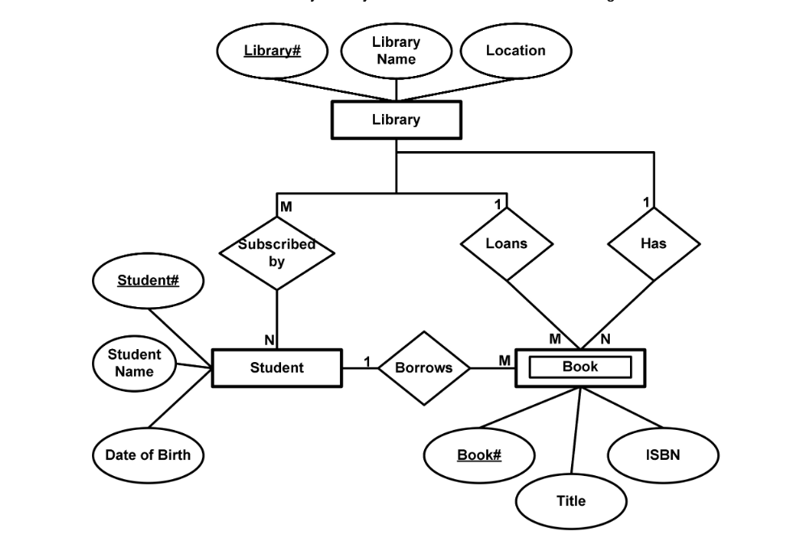

# Assignment 1
Q. Consider requirements of a scenario for E-R model, and write a short description of it. Draw an E-R diagram mentioning the type of attributes (Simple, Composite, Multi Valued) in it. Convert ER model to Relational Model.                  15 Marks

Note: Please create your own and avoid copying others. Marks will be deducted (upto 50%) in case of copying caught. 

---

## Case: University Library

Assuming in a University:
- There are multiple libraries and each library has multiple student members
- Students can become members to multiple libraries by paying appropriate membership fee
- Each Library has it's own set of books
- Each book has a unique ID
- Students can borrow multiple books from a subscribed library
- Students can borrow books from non-subscribed libraries via inter-library loans

---

## ER Diagram

---

## Relational Model

Relations (Tables) can be as follows:

1. Library:
    - library_id (Key)
    - name
    - location

2. Student:
    - student_id (Key)
    - name
    - date of birth

3. Subscriptions:
    - student_id (Foreign Key)
    - library_id (Foreign Key)

4. Book:
    - book_id (Key)
    - title
    - ISBN
    - library_id (Foreign Key) (id of library owning this book)
    - student_id (Foreign Key) (id of student borrowing this book)

5. Loans:
    - loaning_library_id (Foreign Key) (id of library owning the book)
    - borrowing_library_id (Foreign Key) (id of library borrowing the book)
    - student_id (Foreign Key) (id of student borrowing the book)

---

